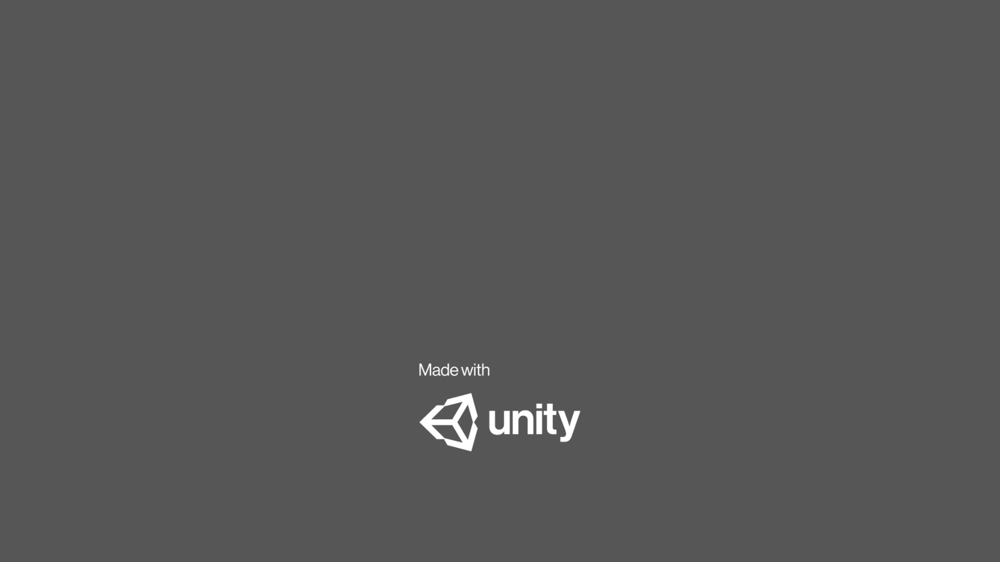
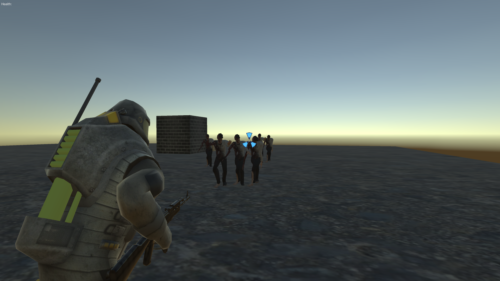

# Unity-3D-basic-game
Third Person, shooter, 3d, game. 
The aim of the project is to adapt and develop myself to Unity. I made a field where features such as how to add character animation, how to integrate mechanics using C# are tested. You can improve it if you wish, I just focused on the basics.  

Double-click "ErtemKaygusuz.exe" to run and play the project.

